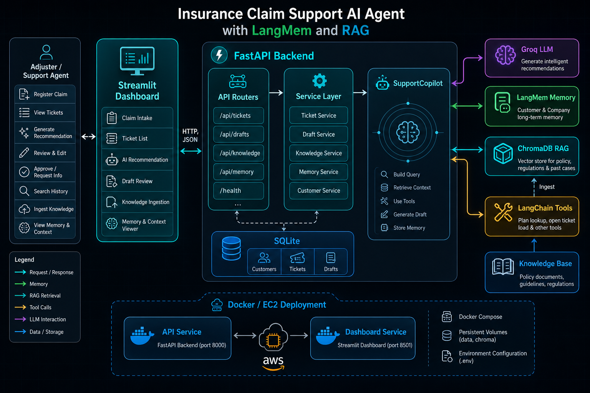

# Insurance Claim Support AI Agent with LangMem and RAG

An AI-powered insurance claims copilot for support agents and claim adjusters. The app helps register FNOL claims, generate coverage recommendations, retrieve claim history, search policy knowledge, and save accepted recommendations back into memory for future cases.

## Features

- FastAPI backend for tickets, drafts, knowledge ingestion, and memory search
- Streamlit dashboard for claim registration and adjuster review
- Groq LLM-powered draft generation
- LangMem/LangGraph customer and company memory
- ChromaDB RAG over local policy and regulation documents
- SQLite persistence for customers, tickets, and generated drafts
- Tool calling for customer plan/load checks
- Docker Compose setup for API and dashboard services
- GitHub Actions workflows for CI and EC2 deployment


## 🏗️ Architecture




```

## Project Structure

```text
.
├── app.py                         # Streamlit dashboard
├── main.py                        # FastAPI backend entry point
├── Dockerfile
├── docker-compose.yml
├── knowledge_base/                # Markdown/text documents for RAG
├── customer_support_agent/
│   ├── api/                       # FastAPI app factory, dependencies, routers
│   ├── core/                      # Settings and directory setup
│   ├── integrations/
│   │   ├── memory/                # LangMem memory store
│   │   ├── rag/                   # ChromaDB knowledge base service
│   │   └── tools/                 # LangChain support tools
│   ├── repositories/sqlite/       # SQLite data access layer
│   ├── schemas/                   # Pydantic request/response models
│   └── services/                  # Copilot, draft, and knowledge services
└── .github/workflows/             # CI and EC2 deployment workflows
```

## Requirements

- Python 3.12+
- uv
- Groq API key
- Google/Gemini API key for embedding-backed RAG and semantic memory

## Environment Variables

Create a `.env` file in the project root:

```env
GROQ_API_KEY=your_groq_api_key
GROQ_MODEL=llama-3.1-8b-instant
LLM_TEMPERATURE=0.2

GOOGLE_API_KEY=your_google_or_gemini_api_key
GOOGLE_EMBEDDING_MODEL=gemini-embedding-001

API_HOST=0.0.0.0
API_PORT=8000
DASHBOARD_API_URL=http://localhost:8000
API_BASE_URL=http://localhost:8000
```

Do not commit `.env`. It is ignored by `.gitignore`.

## Local Setup

Install dependencies:

```powershell
uv sync
```

Start the FastAPI backend:

```powershell
uv run python main.py
```

Start the Streamlit dashboard in another terminal:

```powershell
uv run streamlit run app.py
```

Open:

```text
Backend API: http://localhost:8000
Swagger Docs: http://localhost:8000/docs
Dashboard:    http://localhost:8501
```

## Knowledge Base Ingestion

Put `.md` or `.txt` files inside:

```text
knowledge_base/
```

Then ingest them from the dashboard sidebar or via API:

```http
POST /api/knowledge/ingest
```

Example body:

```json
{
  "clear_existing": false
}
```

The ingestion flow reads documents, splits them into chunks, embeds them, and stores them in ChromaDB under `data/chroma_rag/`.

## Main API Endpoints

```text
GET  /health

POST /api/tickets
GET  /api/tickets
GET  /api/tickets/{ticket_id}
POST /api/tickets/{ticket_id}/generate-draft

GET   /api/drafts/{ticket_id}
PATCH /api/drafts/{draft_id}

POST /api/knowledge/ingest

GET /api/customers/{customer_id}/memories
GET /api/customers/{customer_id}/memory-search
```

## App Flow

1. An adjuster registers a claim in the Streamlit dashboard.
2. The dashboard sends the claim to the FastAPI backend.
3. The backend creates or retrieves the customer in SQLite.
4. The backend creates a ticket in SQLite.
5. If auto-generation is enabled, `DraftService` asks `SupportCopilot` to generate a recommendation.
6. `SupportCopilot` searches customer/company memory.
7. `SupportCopilot` searches the ChromaDB knowledge base.
8. The LangChain agent calls tools if useful.
9. Groq generates a coverage recommendation.
10. The draft and `context_used` are saved in SQLite.
11. The adjuster reviews, edits, approves, or requests more information.
12. Accepted recommendations are saved back into memory for future claims.

## Docker

Run both API and dashboard:

```powershell
docker compose up --build
```

Services:

```text
API:       http://localhost:8000
Dashboard: http://localhost:8501
```

Docker Compose mounts:

```text
./data:/app/data
./knowledge_base:/app/knowledge_base
```

This keeps SQLite, ChromaDB, and knowledge-base files available outside the container.

## Memory Notes

The current memory implementation uses LangGraph `InMemoryStore`. This means customer memories are available while the backend process is running. SQLite tickets and drafts persist across restarts, but LangMem memory does not persist unless a persistent memory store is added later.

## Development Notes

Run tests:

```powershell
uv run pytest -q
```

Compile check:

```powershell
uv run python -m compileall customer_support_agent
```

## Deployment

The repository includes GitHub Actions workflows:

- `.github/workflows/ci.yml`
- `.github/workflows/deploy-ec2.yml`

The EC2 deployment workflow packages the repository, uploads it to EC2, builds Docker services, starts Docker Compose, and checks the API health endpoint.

Required GitHub secrets/vars depend on your deployment setup, commonly:

```text
EC2_HOST
EC2_USER
EC2_PORT
EC2_SSH_KEY
EC2_APP_DIR
EC2_ENV_FILE
INJECT_ENV_FILE
```

## Security

- Keep `.env` out of Git.
- Rotate API keys if they were ever committed or shared.
- Do not commit `data/` because it can contain local databases, vector stores, and runtime artifacts.
- Review generated recommendations before approving them. The AI provides support recommendations; licensed adjusters make final claim decisions.
